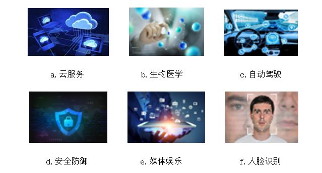
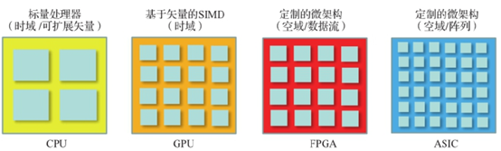
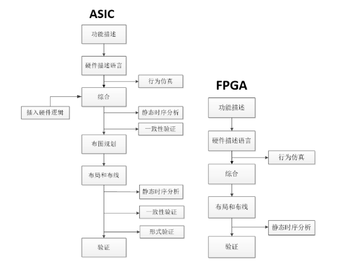

##1.1 深度学习加速器

&emsp;&emsp;深度学习以人工神经网络为基础架构，是机器学习领域的一个重要分支。诸多研究表明，深度学习对于解决现实世界的问题非常有效，已经广泛应用于各个领域。如图1.1所示，深度学习大规模应用于网络云服务、医学生物、媒体娱乐、安全防御、自动驾驶等领域。其中在网络云服务领域主要用于图像分类与语音识别、语言翻译与处理、情绪分析推荐；在医学生物领域主要用于癌细胞检测、糖尿病分级和药物发现；在媒体娱乐方面主要应用于视频字幕、视频搜索和实时翻译；在安全防御领域主要应用于视频监控和卫星图像；在自动驾驶领域主要应用于行人检测、车道跟踪和交通标志的识别。

图1.1 应用领域

&emsp;&emsp;但随着神经网络模型越来越深，基于冯诺依曼体系结构的CPU硬件平台，很难满足神经网络的计算需求。冯诺依曼体系结构的特征都遵循取指、译指、执行的运行流程，从外部存储设备中读取需要处理的数据，并将执行完毕的结果写入到指定的存储地址中。通常按照冯诺依曼体系结构设计的硬件平台都是以ALU（运算逻辑单元）作为计算核心。CPU由于其具有专用性，需要大量的调度指令操作，这样就会占用大量的片上资源。导致CPU不具有很强并行计算单元能力不能达到专用加速的性能。

&emsp;&emsp;GPU是可供选择的另一个平台，GPU压缩了控制逻辑和片上缓存，很好的解决了这个问题。同时GPU使用了大量的SIMD（单指令多数据流）计算单元，使其具有了很强的浮点运算、高带宽、高主频的突出性能，从而极大的提高了GPU的并行计算能力。目前算力较高的GPU处理器使用了很多的流速并行处理计算单元，与CPU处理器较少的核心数量以及线程数相比，GPU通常可以实现非常明显的密集计算加速效果。因此GPU被广泛的用于深度学习的加速训练。但是由于使用过多的计算单元导致GPU处理器的功耗过高，所以GPU处理器一般用于云端服务器和神经网络的训练阶段。

&emsp;&emsp;专用的神经网络芯片（ASIC）作为一种解决方案，可以提供更高的算力和更低的功耗。典型代表为GOOGLE公司的TPU。ASIC的参数都及其极端，它有着极高的计算能力和极低的功耗，它的顶峰计算能力与GPU相比毫不逊色，功耗可能会比GPU低100倍。但是，ASIC芯片研发有着极高的成本和风险。ASIC芯片开发需要大量的人力物力投入，开发周期过长，而且失败的风险极大[13]。

&emsp;&emsp;开发一款专用ASIC的成本是巨大的，一种折中方案就是开发基于FPGA的神经网络加速器。FPGA 凭借它的高并行计算、低功耗和可重复配置的特点在实现神经网络的多种加速器设计中显示了优异的特性。在性能和功耗上，FPGA可以提供接近ASIC的性能和功耗。在灵活性上，又可以具有和CPU接近的可配置性。在多样性上，FPGA解决方案可覆盖从低到高不同的应用场景下的优化方案。

图1.2 不同的框架

图1.3 ASIC设计流程图与FPGA设计流程

