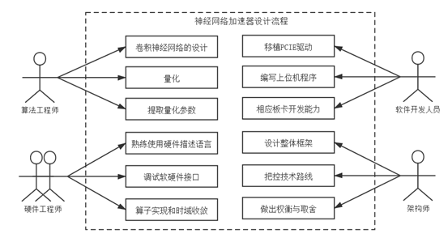
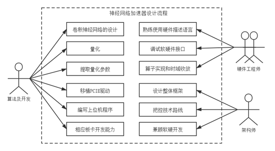

##1.3 人员配置与开发周期

&emsp;&emsp;深度学习网络加速器的设计需要的工程非常大，团队人员配置对项目的开发是非常重要的。一个相对正常的开发团队（Norm模式）往往需要如下的成员：

&emsp;&emsp;➤1名精通Python和Pytorch（或Tensorflow）框架的算法设计者，这名成员能够进行卷积神经网络结构的设计、量化、提取量化参数，提供每一层量化中间结果、开发必须的辅助工具。

&emsp;&emsp;➤1名精通Linux开发的软件开发人员，能移植PCIE驱动，编写上位机程序（图片前处理和后处理）等等。如果上位机不是由PC构成，而是诸如DSP或ARM等嵌入式处理器，则该成员应该具备相应板卡的开发能力。

&emsp;&emsp;➤2-3名FPGA硬件开发人员，使用硬件描述语言、或者HLS、或者SpinalHDL等设计卷积和其它算子、调试PCIE（XDMA）、AXI接口、DDR接口电路等。

&emsp;&emsp;➤1名架构师，把控项目的技术路线、设计项目的整体架构，做各种的权衡和取舍。

&emsp;&emsp;5-6名开发人员中，对架构师的经验要求是最高的，即使在其它人员都是小白（一般计算机本科毕业，没有接触过FPGA和深度学习算法）的情况下，只要合理设计技术路线图、分配项目资源、安排合理项目进度，依然可以在6个月左右完成整个项目的开发。本项目初期的配置即为5人，一名算法工程师，一名软件开发人员，两名硬件工程师和一名架构师。

图1-4 正常模式

&emsp;&emsp;如果人员都有一定的编程经验，则整个团队的规模可以进一步削减，其中软件开发人员和算法工程师的任务合并，硬件开发人员则降低到2名，保留一名架构师，兼顾软硬件开发。尽管减少了2名开发人员，但是在编程经验丰富的情况下，进度可以提高到4个月左右。

图1-5 紧凑模式

&emsp;&emsp;当然人员可以进一步削减，从4名削减到2名，分别为软件工程师和硬件工程师。这将进入一种Hard模式，对开发人员的编程经验和知识储备提供了非常高的要求。一般，软件工程师除了模型的训练、量化和上位机的开发外，可以兼顾软硬件接口的设计，硬件工程师则专注于算子开发和最后的时序收敛。这里硬件工程师还要兼顾架构的设计，由于人手的原因，在设计的时候应该最大化的满足硬件工程师的要求，毕竟软件比硬件更容易修改。

&emsp;&emsp;一名优秀的架构师能够兼顾项目所需的全部角色和具备项目开发所需的全部技术储备。因此在仅有一名架构师的条件下，依旧能够完成整个项目的开发。但这时候，往往是针对具体的神经网络进行专用的加速器的开发，需要在项目初期，使用尽可能少的算子构建神经网络，这样才能最小化整个项目的工作量。但项目所需的工作量是比较庞大的，难免顾此失彼。同时，合理的人员配置和分工能最大化开发效率，并使得项目更容易管理和维护。

图1-6 Hard模式

&emsp;&emsp;在经费需求上，如果是公司，按照4人团队和3个月的开发周期计算，每名程序员的成本在4万/月，因此整个开发的人员成本将达到4x3x4=48万。当开发出第一版后，对其它神经网络的移植工作将会变的比较容易，一般在不增加新的算子支持的情况下，在不超过1周的时间内，既可以重新针对一个具体的应用，具体的网络结构，达到一定性能和精度的神经网络加速器。而人员则可以压缩到1-2名，因此移植成本大约可控制在为5-10万以内。对于需要开发新的算子支持的应用，开发时间一般也不会超过一个月，成本也可控制在20万以内。

&emsp;&emsp;对于高校，由于高校主要是进行研究工作，研究生以学习技术为目的进行开发工作，因此主要是时间成本。在人员配置充裕的情况下，经过半年左右的开发，即可以拥有属于自己的深度学习加速器（平台），在该平台下，可以进行架构、设计空间等方面的研究工作。如果在本教材的指导下，可以在大约1-2个月的时间完成平台的开发，极大的节约研究时间。
