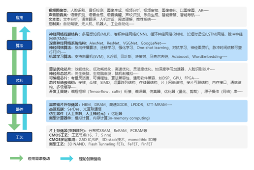

##1.2 技术栈

&emsp;&emsp;使用FPGA深度学习的设计方法和设计空间已经被人们广泛地探索。这些研究成果以论文的形式，发表在各种会议和期刊上。然而，这样研究成果的目的是进行理论研究，并不以实现具体的神经网络加速器为目的。同时，这些成果的复现往往也是非常困难的，尤其是具有工程意义的成果复现。与算法的研究不同，深度学习加速器的研究在GitHub上进行代码开源的并不多，即使开源，往往也是采用HLS的代码，工程意义不大。

&emsp;&emsp;目前，在FPGA上实现通用的神经网络加速器一直是非常困难的工程任务，尤其是使用硬件描述语言（Verilog & VHDL）设计一个工程上可以使用的深度学习加速系统，这往往需要一个团队成员艰苦而卓绝的努力才能完成。对完成的神经网络加速器的任何修改都需要团队成员的共同努力，即使这样，也可能导致不可预测的结果。其困难来自于需要的技术储备远比算法层面的研究要多和复杂。

&emsp;&emsp;如图1.4所示，基于FPGA的神经网络加速器需要在应用、算法和芯片三个层面进行开发，而三个层面涉及的开发技术非常的不同，采用的编程工具、需要的技术储备也各异，并且需要三个层面的相互配合，相互协调才能开发出神经网络加速器。

图1.4 AI芯片相关技术

&emsp;&emsp;在应用层面，往往需要领域的专用知识，这一层面对编程的要求不高，技术难度相对较小，在整个开发过程中相对不重要。在算法层面，需要对诸如Pytorch等框架非常熟悉，对各种新的网络结构非常熟悉，尤其是需要具备量化训练的能力，提取量化后参数的能力，并进行中间结果数据分析的能力，更需要和芯片设计人员进行持续的交流和沟通。在这一层面，一般的开发人员往往欠缺的是量化方面的技术、以及与芯片设计人员沟通的能力。原因是，芯片设计和算法设计是两个差别非常大的领域。在芯片设计层面，往往欠缺的不是FPGA的编码能力，而是对神经网络的算法的理解。芯片设计人员往往缺乏对神经网络算法的了解，无法正确的理解神经网络计算，尤其是无法对算法层面的开发人员提出正确的需求。

&emsp;&emsp;虽然在FPGA上实现通用的神经网络加速器是一个工程问题，但是这一工程问题的巨大工作量和技术难度，阻碍了这一技术在更广泛领域的应用。尤其是当我们在边缘端部署神经网络的时候，我们本能的想到使用NVIDIA的嵌入式GPU（Jetson TX2 ，Jetson Nano等），因为这些嵌入式GPU的编程非常简单，在各种深度学习框架的支持下，可以非常快速的（甚至是直接使用训练代码）移植代码到嵌入式GPU平台。不夸张的说，这种移植的工作量甚至可以削减到“0”。当然对移植后代码的进一步优化也需要一些工作量，然而这些工作量与在FPGA上实现神经网络加速器的工作量相比，往往连1%都不到。

&emsp;&emsp;巨大的工作量和技术鸿沟，是阻碍使用FPGA进行神经网络加速的主要困难。尽管Xilinx公开了DPU这一神经网络加速器，但是其仅仅能在ZYNQ上自由使用，在纯FPGA的形式，只支持自己的Avlon加速卡。即使在ZYNQ上，面对其不支持的算子，Xilinx也没有公开添加新算子的接口，这些都是阻碍基于FPGA的神经网络加速器发展的原因。

&emsp;&emsp;面对这样一个困境，为了在今后的项目和科研中有一个灵活可配置，支持各种不同的网络结构，能在不同的FPGA快速部署的神经网络加速器。我们编写了这一教程，使得我们的研究生能快速的进入这一领域，也为了今后应对不同领域的任务时，快速的开发对应的版本。 
